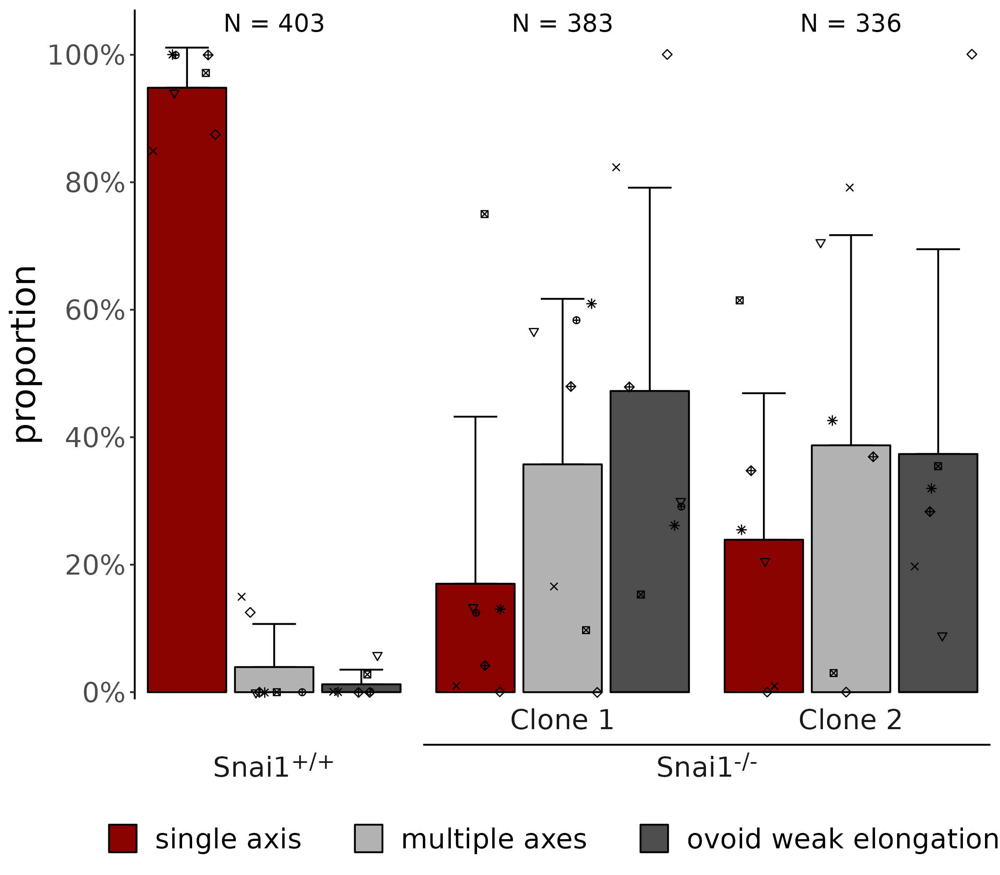

# Phenotype of Snai1 mutant analysis

Gastruloids were manually classified as 'multiple axes', 'ovoid weak elongation' or 'single axis'. Results are summarized in the [txt](./input_phenotype.txt). Statistical analysis and plot are performed with R with the [following script](./stats_Snai1.qmd).

Here is the result:

